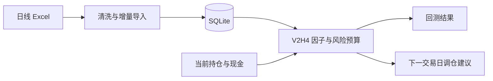

# A-Share V2H4

面向中国 A 股的因果多因子研究、周频回测与持仓调整工具。

*A causal multi-factor research, backtesting, and weekly portfolio rebalancing engine for China A-shares.*

项目从日线行情构建低 Beta、低波动、低换手、短期反转、回撤和行业趋势信号，使用前一交易日可得信息生成下一交易日计划，并在回测中处理历史税费、滑点、成交额约束、板块申报数量、现金分红与送转股。

> 本项目用于量化研究和组合辅助，不连接券商、不自动下单，也不构成投资建议。

## 项目亮点

- **因果回测**：决策日只读取当日及以前的数据，交易安排在下一交易日。
- **A 股执行约束**：主板、创业板、科创板和北交所采用对应申报数量规则。
- **历史费用分段**：按交易日期计算印花税、经手费、监管费和过户费。
- **公司行动记账**：使用总回报与资本回报重建现金分红和送转股影响。
- **低换手组合**：周频再平衡、买卖排名缓冲和无交易区间共同控制换手。
- **实盘辅助接口**：读取已有持仓与现金，输出下一交易日订单建议和预计持仓。
- **可复现工程**：配置文件、示例账户、自动对比表、单元测试和 GitHub Actions 齐全。

## 系统流程



## 公开目录

```text
.
├── ashare_utils.py                 # A 股费用、申报数量、持仓与 Excel 工具
├── clean_resset_data.py            # 日线 Excel 增量导入 SQLite
├── validate_clean_data.py          # 数据质量检查
├── database_status.py              # 数据库日期范围检查
├── factor_rank_backtest.py         # 基础特征、市场状态与公司行动
├── factor_rank_backtest_v2h.py     # V2H4 因果周频回测
├── weekly_rebalance_v2h.py         # 已有持仓的下一交易日调仓建议
├── compare_backtest_results.py     # 多组回测对比表
├── run_weekly.ps1                  # 每周导入、检查、调仓
├── run_v2h4_validation.ps1         # 基准、候选、压力测试
├── config/                         # 两套可复现策略配置
├── data/input/                     # 账户示例文件
├── tests/                          # 核心规则单元测试
└── WEEKLY_FRIDAY_GUIDE.md          # 每周操作说明
```

原始行情、数据库、真实持仓、财报、回测输出和个人配置均由 `.gitignore` 排除。

## 环境安装

需要 Python 3.10 或更高版本。

```powershell
git clone https://github.com/<username>/<repository>.git
cd <repository>

python -m venv .venv
Set-ExecutionPolicy -Scope Process -ExecutionPolicy Bypass -Force
.\.venv\Scripts\Activate.ps1
python -m pip install -r requirements.txt
```

macOS/Linux：

```bash
python3 -m venv .venv
source .venv/bin/activate
python -m pip install -r requirements.txt
```

## 输入数据

清洗器读取 `.xlsx` 文件。文件名建议使用：

```text
YYYY_YYYYMMDD_N.xlsx
```

例如：

```text
2026_20260710_1.xlsx
2026_20260710_2.xlsx
```

放入：

```text
data/raw/market_data/
```

当前数据适配器识别以下字段后缀：

| 内容 | 字段后缀 |
|---|---|
| 股票代码、名称、日期 | `Stkcd`, `Lstknm`, `Date` |
| 昨收、开高低收 | `PrevClPr`, `Oppr`, `Hipr`, `Lopr`, `Clpr` |
| 成交量、成交额、换手率 | `Trdvol`, `Trdsum`, `DFulTurnR`, `DTrdTurnR` |
| 总回报、资本回报 | `Dret`, `Daret` |
| 复权信息 | `AdjClpr1`, `AdjClpr2`, `Mcfacpr` |
| 上市状态、币种、行业 | `Listedstate`, `Qttncurrency`, `Csrciccd1`, `Csrciccd2` |

其中 `Dret` 与 `Daret` 用于公司行动记账，不应省略。使用其他供应商时，需要编写相同 SQLite 表结构的数据适配器。

## 建立数据库

```powershell
python clean_resset_data.py `
  --source-dir data/raw/market_data `
  --database data/processed/stock_daily.sqlite `
  --reset

python validate_clean_data.py data/processed/stock_daily.sqlite
python database_status.py --database data/processed/stock_daily.sqlite
```

`--reset` 只用于首次建库或明确重建。后续导入会按 `code + trade_date` 更新记录，并跳过未变化的源文件。

## 运行回测

基准策略：

```powershell
python factor_rank_backtest_v2h.py `
  --strategy-config config/v2h4_strategy.json `
  --database data/processed/stock_daily.sqlite `
  --start-date 2021-01-05 `
  --end-date 2026-07-07 `
  --output-dir outputs/backtest/v2h4
```

Windows 下也可以一次运行基准、候选参数和滑点压力测试：

```powershell
.\run_v2h4_validation.ps1 `
  -Database data/processed/stock_daily.sqlite `
  -StartDate 2021-01-05 `
  -IncludeStress
```

结束日期留空时，脚本自动使用数据库最大交易日。完成后生成：

```text
outputs/validation_full/v2h4_comparison.xlsx
```

仓库不提交本地回测结果。这样既避免数据许可问题，也要求使用者在自己的数据上复现结果，而不是只依赖一张静态收益图。

## 已有持仓调仓

先复制账户模板：

```powershell
Copy-Item data/input/positions.example.csv data/input/positions.csv
Copy-Item data/input/account_state.example.json data/input/account_state.json
```

持仓格式：

```csv
code,name,shares,cost_price
000001,示例股票,1200,10.85
CASH,现金,235000,
```

生成下一交易日建议：

```powershell
python weekly_rebalance_v2h.py `
  --database data/processed/stock_daily.sqlite `
  --positions data/input/positions.csv `
  --strategy-config config/v2h4_strategy.json `
  --output-dir outputs/weekly_rebalance
```

输出包含：

- `summary`：风险状态、目标仓位、费用和警告；
- `orders`：建议买卖方向、股数和参考价格；
- `projected_positions`：假设全部成交后的预计持仓；
- `factor_ranking`：股票池及六项因子排名。

具体周末流程见 [WEEKLY_FRIDAY_GUIDE.md](WEEKLY_FRIDAY_GUIDE.md)。

## 策略概要

V2H4 静态因子权重：

| 因子 | 权重 |
|---|---:|
| 低 Beta | 25% |
| 低波动 | 21% |
| 低换手 | 17% |
| 短期反转 | 15% |
| 行业趋势 | 12% |
| 较小回撤 | 10% |

主要组合约束：

- 至少 252 个交易日历史；
- 近 60 日平均成交额过滤；
- 剔除 ST、非正常上市状态和市值代理最低 30%；
- 目标约 40 只股票；
- 单股上限 3.5%，单行业上限 20%；
- 周频调仓，买入排名 90，卖出排名 180；
- 波动率、趋势、市场宽度和组合回撤共同决定股票总仓位。

完整参数见 `config/v2h4_strategy.json`。

## 回测严谨性

项目针对常见量化偏差做了以下处理：

- 特征计算限制在决策日及以前；
- 财务数据只允许公告日不晚于决策日；
- 决策后在下一交易日开盘附近成交；
- 回测包含单边滑点和成交额参与率上限；
- 税费按历史日期变化，不使用当前税率覆盖全部历史；
- 送转股调整持股数量，现金分红进入现金账户；
- 结果同时报告收益、波动、Sharpe、回撤、换手、费用和实际股票仓位。

这些处理不能消除所有模型风险，但能显著减少未来函数和执行假设造成的虚假收益。

## 测试

```powershell
python -m unittest discover -s tests -v
```

GitHub Actions 会在每次 push 和 pull request 时自动运行核心测试。

## 已知限制

- 日线级回测无法重建盘中成交队列和真实冲击成本。
- 停牌、涨跌停和券商可用资金仍需在下单前人工复核。
- 市值使用成交额与换手率构造代理值，取决于源数据完整性。
- 股票因子和参数可能发生样本外失效，不能把历史表现视为未来收益保证。
- 该工具生成订单建议，但不会执行交易。

## License

[MIT](LICENSE)
