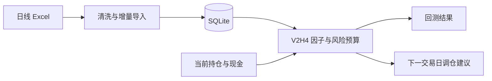

# A-Share V2H4

面向中国 A 股的因果多因子研究、周频回测与持仓调整工具。

*A causal multi-factor research, backtesting, and weekly portfolio rebalancing engine for China A-shares.*

项目从日线行情构建低 Beta、低波动、低换手、短期反转、回撤和行业趋势信号，使用前一交易日可得信息生成下一交易日计划，并在回测中处理历史税费、滑点、成交额约束、板块申报数量、现金分红与送转股。

> 本项目用于量化研究和组合辅助，不连接券商、不自动下单，也不构成投资建议。

## 项目亮点

- **因果回测**：决策日只读取当日及以前的数据，交易安排在下一交易日。
- **A 股执行约束**：主板、创业板、科创板和北交所采用对应申报数量规则。
- **历史费用分段**：按交易日期计算印花税、经手费、监管费和过户费。
- **公司行动记账**：使用总回报与资本回报重建现金分红和送转股影响。
- **低换手组合**：周频再平衡、买卖排名缓冲和无交易区间共同控制换手。
- **多账户实盘辅助**：按账户隔离持仓、净值峰值、风险状态和订单输出。
- **可复现工程**：配置文件、示例账户、自动对比表、单元测试和 GitHub Actions 齐全。

## 系统流程



## 公开目录

```text
.
├── ashare_utils.py                 # A 股费用、申报数量、持仓与 Excel 工具
├── clean_resset_data.py            # 历史日线 Excel 建库
├── import_csmar_forward_quotation.py # 周度前推行情增量续接
├── validate_clean_data.py          # 数据质量检查
├── database_status.py              # 数据库日期范围检查
├── factor_rank_backtest.py         # 基础特征、市场状态与公司行动
├── factor_rank_backtest_v2h.py     # V2H4 因果周频回测
├── weekly_rebalance_v2h.py         # 已有持仓的下一交易日调仓建议
├── compare_backtest_results.py     # 多组回测对比表
├── capital_scale_analysis.py       # 不同资金规模的费用、容量与稳健排名
├── run_weekly.ps1                  # 每周导入、检查、调仓
├── update_live_risk_model.ps1      # 实盘风险模型与V3.1 Alpha增量更新
├── live_trading_official/          # 正式实盘操作中心与一键入口
├── run_v2h4_validation.ps1         # 基准、候选、压力测试
├── run_20k_commission_validation.ps1 # 2 万元账户的费用与小资金候选对比
├── run_capital_scale_validation.ps1 # 2 万至 1000 万元的策略规模扫描
├── config/                         # 正式、legacy 与压力候选配置
├── data/input/                     # 账户示例文件
├── tests/                          # 核心规则单元测试
└── WEEKLY_FRIDAY_GUIDE.md          # 每周操作说明
```

本机或部署环境中的日常实盘操作，优先从
`live_trading_official/` 进入。该目录集中提供单账户、全部账户、只更新行情与
风险模型、状态检查等入口；底层模块仍保留在项目根目录作为唯一源码。

原始行情、数据库、真实持仓、财报、回测输出和个人配置均由 `.gitignore` 排除。

## 环境安装

需要 Python 3.10 或更高版本。

```powershell
git clone https://github.com/<username>/<repository>.git
cd <repository>

python -m venv .venv
Set-ExecutionPolicy -Scope Process -ExecutionPolicy Bypass -Force
.\.venv\Scripts\Activate.ps1
python -m pip install -r requirements.txt
```

macOS/Linux：

```bash
python3 -m venv .venv
source .venv/bin/activate
python -m pip install -r requirements.txt
```

## 输入数据

项目区分两类 `.xlsx`：首次建库使用历史行情适配器，数据库建成后的每周更新使用前推行情适配器。文件名建议使用：

```text
YYYY_YYYYMMDD_N.xlsx
```

例如：

```text
2026_20260710_1.xlsx
2026_20260710_2.xlsx
```

放入：

```text
data/raw/market_data/
```

历史行情适配器识别以下字段后缀：

| 内容 | 字段后缀 |
|---|---|
| 股票代码、名称、日期 | `Stkcd`, `Lstknm`, `Date` |
| 昨收、开高低收 | `PrevClPr`, `Oppr`, `Hipr`, `Lopr`, `Clpr` |
| 成交量、成交额、换手率 | `Trdvol`, `Trdsum`, `DFulTurnR`, `DTrdTurnR` |
| 总回报、资本回报 | `Dret`, `Daret` |
| 复权信息 | `AdjClpr1`, `AdjClpr2`, `Mcfacpr` |
| 上市状态、币种、行业 | `Listedstate`, `Qttncurrency`, `Csrciccd1`, `Csrciccd2` |

其中 `Dret` 与 `Daret` 用于公司行动记账，不应省略。

周度前推行情由 `import_csmar_forward_quotation.py` 读取，至少需要：

```text
TradingDate, Symbol, OpenPrice, ClosePrice, HighPrice, LowPrice,
Volume, Amount, StateCode, ChangeRatio, TurnoverRate1,
AValue, ACirculatedShare
```

对于 A 股，`AValue + ACirculatedShare` 是优先下载口径。若页面不提供这两个字段，则同时下载 `MarketValue + TotalShare` 和 `CirculatedMarketValue + CirculatedShare`，不要只选其中一组。下载前复权数据是允许的，但前推行情的 `ClosePrice` 是“交易所原价乘累计复权因子”，不能直接用于真实订单，也不能把不同下载批次的价格列直接拼接。导入器优先以 `AValue / ACirculatedShare`（元/股）还原 A 股未复权收盘价；备用的两种公司市值口径若不一致，会改用上一真实收盘价续接当日 `ChangeRatio` 并在导入日志中计数。数据库同时保留连续信号价和未复权执行价：因子使用前者，周调仓估值、整手取整和参考价格使用后者。

`TRD_Dalyr（日个股回报率文件）` 的未复权 `Opnprc/Hiprc/Loprc/Clsprc` 是更直接的真实价格来源。不过当前 `import_csmar_forward_quotation.py` 只接收前/后复权行情字段；在项目增加 `TRD_Dalyr` 适配器前，不要把该表直接放进本目录混合导入。

导入器会用本文件首日之前的数据库最新收盘价续接 `ChangeRatio`，因此可以安全处理每周文件以及与数据库重叠的日期。使用其他供应商时，需要实现相同 SQLite 表结构的数据适配器。

## 建立数据库

### 从完整 CSMAR 导出重建

完整的 `TRD_Dalyr`、`TRD_AdjustFactor`、`TRD_Co` 和 `TRD_NoLimit` 工作簿可用流式建库器导入，不会一次性把百万行 Excel 载入内存：

```powershell
python build_csmar_database.py `
  --source-dir "data/raw/CSMAR raw data" `
  --database "data/processed/csmar_stock_daily_full.sqlite" `
  --start-date "2019-01-01" `
  --end-date "2026-07-17" `
  --reset
```

建库器只保留沪深京 A 股，以未复权 OHLC 作为成交价格，使用含现金红利再投资回报和不含现金红利回报分别记录总回报与资本回报，并导入复权因子和无涨跌停日期。若 `TRD_Co` 没有行业字段，程序会临时沿用旧数据库行业映射；正式回测前应补齐完整公司行业元数据。

```powershell
python clean_resset_data.py `
  --source-dir data/raw/market_data `
  --database data/processed/stock_daily.sqlite `
  --reset

python validate_clean_data.py data/processed/stock_daily.sqlite
python database_status.py --database data/processed/stock_daily.sqlite
```

`--reset` 只用于首次建库或明确重建。历史库建好后，每周导入前推行情：

```powershell
python import_csmar_forward_quotation.py `
  --source-dir data/raw/market_data `
  --database data/processed/stock_daily.sqlite `
  --years 2026 `
  --apply

python validate_clean_data.py data/processed/stock_daily.sqlite
python database_status.py --database data/processed/stock_daily.sqlite
```

前推导入按 `code + trade_date` 更新记录，并自动跳过已经成功导入且没有变化的源文件。不加 `--apply` 时只检查格式和可导入范围，不修改数据库。

## 运行回测

基准策略：

```powershell
python factor_rank_backtest_v2h.py `
  --strategy-config config/v2h4_strategy.json `
  --database data/processed/stock_daily.sqlite `
  --start-date 2021-01-05 `
  --end-date 2026-07-10 `
  --initial-cash 1000000 `
  --output-dir outputs/backtest/v2h4
```

Windows 下也可以依次运行正式策略、旧版对照和可选的滑点压力测试，并开启断点续跑：

```powershell
.\run_v2h4_validation.ps1 `
  -Database data/processed/stock_daily.sqlite `
  -StartDate 2021-01-05 `
  -IncludeStress `
  -EnableCheckpoints `
  -CheckpointEveryNDays 5 `
  -Resume
```

结束日期留空时，脚本自动使用数据库最大交易日。运行中按一次 `Ctrl+C`，程序会完成当前交易日、保存检查点并退出；重新执行同一条带 `-Resume` 的命令即可继续。数据库、策略参数、日期范围或代码发生变化时，旧检查点会被拒绝，防止混用不一致的状态。已经完整生成汇总 JSON 和工作簿的阶段会自动跳过。完成后生成：

```text
outputs/validation_full/v2h4_comparison.xlsx
```

仓库不提交本地回测结果。这样既避免数据许可问题，也要求使用者在自己的数据上复现结果，而不是只依赖一张静态收益图。

### 券商佣金

`config/v2h4_strategy.json` 中的 `broker_commission_rate` 和
`broker_minimum_commission` 会同时作用于回测现金流、周调仓买入预算和输出摘要。
仓库当前示例值分别为 `0.0003`（万分之三）和 `5.0` 元/笔；使用者必须改成自己的真实费率。
法定税费仍按交易日期和交易方向另行计算，不能用券商佣金替代。

## 已有持仓调仓

每个真实账户都必须有一个稳定且唯一的账户 ID。账户 ID 只使用英文字母、数字、下划线或短横线，例如 `account_a`、`account_b`；建立后不要随意更名，因为它同时决定持仓、风险状态和输出目录。

下面的命令创建两个相互隔离的账户：

```powershell
$Accounts = @("account_a", "account_b")

foreach ($AccountId in $Accounts) {
  $AccountDir = "data/input/accounts/$AccountId"
  New-Item -ItemType Directory -Force $AccountDir

  if (-not (Test-Path "$AccountDir/positions.csv")) {
    Copy-Item data/input/positions.example.csv "$AccountDir/positions.csv"
  }
}
```

逐一编辑各自的 `positions.csv`，填写券商显示的真实持股、成本价和可用于买股的现金。不要在账户之间复制 `account_state.json`，也不要把一个账户的持仓文件交给另一个账户运行。

持仓格式如下：

```csv
code,name,shares,cost_price
000001,示例股票,1200,10.85
CASH,现金,235000,
```

首次运行时，程序会在同一账户目录自动创建 `account_state.json`，用来记录该账户自己的净值峰值和回撤状态。以后每周应继续使用同一个账户 ID。

不同账户可以使用不同策略。默认不需要手工指定配置：程序会用最新未复权收盘价计算“股票市值 + 可用现金”，再按当前账户总资产自动选择经过资金规模回测的策略。下面分别运行账户 A 和账户 B；第二次运行会跳过已经导入且没有变化的行情文件：

```powershell
powershell.exe -NoProfile -ExecutionPolicy Bypass `
  -File .\run_weekly.ps1 `
  -Python .\.venv\Scripts\python.exe `
  -Database data\processed\stock_daily.sqlite `
  -SourceDir data\raw\market_data `
  -RiskDatabase data\processed\weekly_risk_model.sqlite `
  -RiskCalibrationSchedule data\processed\weekly_risk_calibration_schedule.csv `
  -AccountId account_a `
  -Year (Get-Date).Year

powershell.exe -NoProfile -ExecutionPolicy Bypass `
  -File .\run_weekly.ps1 `
  -Python .\.venv\Scripts\python.exe `
  -Database data\processed\stock_daily.sqlite `
  -SourceDir data\raw\market_data `
  -RiskDatabase data\processed\weekly_risk_model.sqlite `
  -RiskCalibrationSchedule data\processed\weekly_risk_calibration_schedule.csv `
  -AccountId account_b `
  -Year (Get-Date).Year
```

自动资金分档保存在 `config/weekly_capital_strategy_map.json`：

| 当前账户总资产 | 自动策略 |
|---:|---|
| 低于 5 万元 | 2万元验证版：V2.2S月度行业入场与权重卫星、12只、风险叠加、Q90集合竞价 |
| 5 万元至低于 30 万元 | 10万元严格连续验证版：V2.2 R3、20只、价值质量倾斜、UNKNOWN行业5%上限、Q97.5集合竞价 |
| 30 万元至低于 75 万元 | 56万元严格连续验证版：V2.2 R3、20只、价值质量倾斜、UNKNOWN行业5%上限、Q97.5集合竞价 |
| 75 万元及以上 | 100万元严格连续验证版：V2.2 R3、20只、价值质量倾斜、UNKNOWN行业5%上限、Q97.5集合竞价 |

当前自动部署版本的验证点是V2.2S的2万元策略，以及V2.2 R3的10万元、56万元和100万元。高于100万元时程序仍使用100万元档，但会在 `warnings` 中提示容量外推。确需固定某个配置时，仍可传入 `-StrategyConfig <配置路径>`，它会覆盖自动选择。

所有自动档都必须传入 `-RiskDatabase`。2万元档使用其中的风险叠加快照和月度冻结行业趋势信号；V2.2 R3资金档使用其中的时点化盈利收益率和质量Alpha。需要的数据距离决策日最多允许14个自然日；缺少或过期时周调仓会停止，不会悄悄删除财务Alpha。`-RiskCalibrationSchedule` 只影响启用风险叠加的策略，可省略，此时使用配置中的固定校准倍率。

`run_weekly.ps1` 默认会在生成订单前，把风险侧库中的市值、周频风险快照和V3.1 Alpha缓存增量更新到行情库最大日期。模型结束日期只是滚动计算边界，不再造成整套历史检查点失效。若旧侧库曾把某个周行情文件标记为已导入却缺少对应市值行，流程会只重导小型周文件，不会重读大型历史市值文件。`-SkipRiskModelUpdate` 仅供已经独立完成并核对更新的高级用法，正常实盘流程不要传入。

2万元账户已经自动切换到 `config/v22s_20k_entry_weight_monthly_06_official.json`。它保留小账户整手与佣金约束、风险叠加和Q90竞价，并以每月第一个周末决策日冻结的行业 20/60 日相对趋势，调整新股票入场优先级与目标权重。详情见 [ACCOUNT_STRATEGY_TIERS.md](ACCOUNT_STRATEGY_TIERS.md)。

`run_weekly.ps1` 会自动读取 `data/input/accounts/<账户ID>/positions.csv`，把状态写入同一账户目录，并把结果写入 `outputs/weekly_rebalance_v2h4/<账户ID>/`。状态文件中的账户 ID 不匹配时，程序会拒绝运行。控制台、`summary` 和 `account_state.json` 都会记录本次选择的资金档位和策略配置。

输出包含：

- `summary`：风险状态、目标仓位、费用和警告；
- `orders`：建议买卖方向、股数和参考价格；
- `filtered_orders`：因交易金额门槛等原因未进入正式订单的候选及原因；
- `projected_positions`：假设全部成交后的预计持仓；
- `factor_ranking`：股票池及六项因子排名。

`summary.target_equity_weight` 是行情状态给出的基础仓位，`summary.effective_target_equity_weight` 是经过风险覆盖层和组合目标变换后的最终有效目标。判断账户是否偏离目标时，应比较 `current_equity_weight`、`projected_equity_weight` 与 `effective_target_equity_weight`。

周调仓带有换仓仓位保护：如果旧股票可以卖出，但替代买单因交易门槛、整手、现金或集合竞价可成交性而不可执行，程序会延期对应卖单，避免换股失败意外形成大额空仓。模型明确要求降低总仓位时，净卖出仍会正常执行。

`orders.reference_close` 是决策日未复权市场收盘价。正式竞价策略把价格拆开显示：`indicative_price`/`estimated_execution_price` 是历史开盘缺口的中位预测；`broker_order_limit_price`/`auction_limit_price` 是集合竞价保护边界，买入表示最高接受价、卖出表示最低接受价；`cash_reservation_price` 用于整手和现金预算。保护边界不是预测成交价。

集合竞价限价单若成交，按交易所形成的单一开盘价成交，而不是必然按保护边界成交。建议在 `09:15-09:20` 可撤单阶段观察虚拟开盘参考价后提交；开盘集合竞价后仍未成交的剩余委托应撤销，不要让激进限价继续进入连续竞价。

具体周末流程见 [WEEKLY_FRIDAY_GUIDE.md](WEEKLY_FRIDAY_GUIDE.md)。

## 策略概要

当前5万元及以上资金档部署V2.2 R3：在原V2H4排名上保留90%核心分数，加10%时点化盈利收益率/质量Alpha，并将无法识别行业的合计目标权重限制在5%。三个已验证资金档均使用20只股票和Q97.5集合竞价执行模型。

V2H4 静态因子权重：

| 因子 | 权重 |
|---|---:|
| 低 Beta | 25% |
| 低波动 | 21% |
| 低换手 | 17% |
| 短期反转 | 15% |
| 行业趋势 | 12% |
| 较小回撤 | 10% |

主要组合约束：

- 至少 252 个交易日历史；
- 近 60 日平均成交额过滤；
- 剔除 ST、非正常上市状态和市值代理最低 30%；
- 目标约 40 只股票；
- 单股上限 3.5%，单行业上限 20%；
- 周频调仓，买入排名 90，卖出排名 180；
- 波动率、趋势、市场宽度和组合回撤共同决定股票总仓位。

完整参数见 `config/v2h4_strategy.json`。

### 账户规模与整手自适应执行

正式 `config/v2h4_strategy.json` 已采用按组合总资产缩放且能够实际成交的执行规则：

- 普通持仓调整门槛：组合总资产的 2.0%；
- 新建仓门槛：组合总资产的 0.35%；完全清仓不受最低成交额阻挡；
- 当实际股票仓位高于风险目标超过 3% 时，卖出使用独立的 1% 风险降仓门槛；
- 当实际股票仓位低于风险目标超过 3% 时，买入也使用独立的 1% 风险恢复门槛；
- 当组合股票仓位偏离风险目标超过 3% 时，暂时绕过单股免调仓带，避免局部不交易规则阻挡组合风险预算；
- 门槛基数是股票市值加现金的组合总资产，不是会随订单变化的可用现金；
- 主板和创业板买入按 100 股整手，科创板和北交所使用各自申报规则；
- 排名靠前但最小一手成本超过账户预算时，继续检查后续候选，而不是留下不可执行目标；
- 小账户会自动减少目标持股数，并相应放宽单股和行业上限；
- 组合级最大余数取整把剩余预算分配成额外整手，使实际股票仓位接近风险模型目标。

历史结果如果没有计入真实券商佣金，不能与当前版本直接比较。特别是存在每笔最低佣金时，小额账户的订单数量和平均订单金额会显著影响净收益，应以重新运行后生成的汇总 JSON 和对比表为准。

2 万元账户把已验证基准和后续实验分成独立配置，避免优化时覆盖历史最优版本：

- `config/v2h4_small_account_20k_best_20260723.json`：冻结的 12 股 banded 基准；
- `config/v2h4_small_account_20k_best_20260724_sparse_weekly.json`：当前表现最优的周度稀疏风险版本；
- `config/v2h4_small_account_20k_strict_full_rejected_20260724.json`：严格全量风险对齐复现版，因订单和费用显著增加而被淘汰；
- `config/v2h4_small_account_20k_sparse_weekly.json`：周度稀疏风险实验文件，冻结后的正式版本见上面的 `best_20260724` 文件。

新候选必须在相同数据、相同初始资金和相同费用下回测，确认胜出后才能替换冻结基准：

```powershell
python factor_rank_backtest_v2h.py `
  --strategy-config config/v2h4_small_account_20k_sparse_weekly.json `
  --database data/processed/stock_daily.sqlite `
  --start-date 2021-01-05 `
  --initial-cash 20000 `
  --output-dir outputs/validation_20k_sparse_weekly
```

约 10 万元的账户通常已经不属于“整手约束特别严重”的小资金账户，可以先使用正式 `config/v2h4_strategy.json`。但每笔最低 5 元佣金仍会影响小额订单，因此它仍属于需要关注费用的中等规模账户；是否需要专门减少持股数或换手，应通过相同费率下的 10 万元回测决定，而不是只按账户名义资金判断。

### 资金规模扫描

策略不能按最接近的已知账户金额直接套用。最低佣金、整手取整、持股分散度和流动性容量会随资金规模以不同速度变化。项目提供统一扫描脚本，在相同数据库、日期和费用口径下比较 12、20、25、40、60 和 80 股方法：

先单独建立共享因子快照。因子计算只执行一次，后续全部资金和持股数实验读取同一个缓存：

```powershell
powershell.exe -NoProfile -ExecutionPolicy Bypass `
  -File .\run_capital_scale_validation.ps1 `
  -Python .\.venv\Scripts\python.exe `
  -Database data\processed\stock_daily.sqlite `
  -IncludeCapacityStress `
  -BuildFeatureCacheOnly
```

内存允许时，可以在两个 PowerShell 窗口分别启动两个分片：

```powershell
# 窗口 A
powershell.exe -NoProfile -ExecutionPolicy Bypass `
  -File .\run_capital_scale_validation.ps1 `
  -Python .\.venv\Scripts\python.exe `
  -Database data\processed\stock_daily.sqlite `
  -IncludeCapacityStress `
  -ShardCount 2 `
  -ShardIndex 0 `
  -Resume

# 窗口 B
powershell.exe -NoProfile -ExecutionPolicy Bypass `
  -File .\run_capital_scale_validation.ps1 `
  -Python .\.venv\Scripts\python.exe `
  -Database data\processed\stock_daily.sqlite `
  -IncludeCapacityStress `
  -ShardCount 2 `
  -ShardIndex 1 `
  -Resume
```

两个分片只读同一个行情库和共享因子缓存，但写入完全不同的输出目录。16GB 内存电脑不应使用超过两个并发进程；若单个新进程的工作集仍高于约 5GB，应改回 `ShardCount 1` 顺序运行。

默认基础矩阵覆盖 2 万、5 万、10 万、20 万、50 万、100 万、500 万和 1000 万元；500 万和 1000 万元可额外运行 10/20 bps 滑点与 2%/1% 成交参与率压力测试。每个组合都有独立检查点，按一次 `Ctrl+C` 后重新执行同一分片命令即可继续。

结果写入 `outputs/validation_csmar_capital_scale/`。对比工作簿同时报告完整区间和留出区间收益、Sharpe、回撤、费用、最低佣金触发率、平均订单金额和流动性参与率。自动稳健排名只用于缩小候选范围，最终选择仍需检查相邻资金规模是否给出一致结论。

旧固定门槛配置保留在 `config/v2h4_fixed_floor_legacy.json`，只用于复现对照。运行正式版、legacy 和正式版 10 bps 压力测试：

```powershell
.\run_v2h4_validation.ps1 `
  -Database data/processed/stock_daily.sqlite `
  -StartDate 2021-01-05 `
  -IncludeStress
```

## 回测严谨性

项目针对常见量化偏差做了以下处理：

- 特征计算限制在决策日及以前；
- 财务数据只允许公告日不晚于决策日；
- 决策后在下一交易日开盘附近成交；
- 回测包含单边滑点和成交额参与率上限；
- 税费按历史日期变化，不使用当前税率覆盖全部历史；
- 送转股调整持股数量，现金分红进入现金账户；
- 结果同时报告收益、波动、Sharpe、回撤、换手、费用和实际股票仓位。

这些处理不能消除所有模型风险，但能显著减少未来函数和执行假设造成的虚假收益。

## 测试

```powershell
python -m unittest discover -s tests -v
```

GitHub Actions 会在每次 push 和 pull request 时自动运行核心测试。

## 已知限制

- 日线级回测无法重建盘中成交队列和真实冲击成本。
- 停牌、涨跌停和券商可用资金仍需在下单前人工复核。
- 市值使用成交额与换手率构造代理值，取决于源数据完整性。
- 股票因子和参数可能发生样本外失效，不能把历史表现视为未来收益保证。
- 该工具生成订单建议，但不会执行交易。

## License

[MIT](LICENSE)
